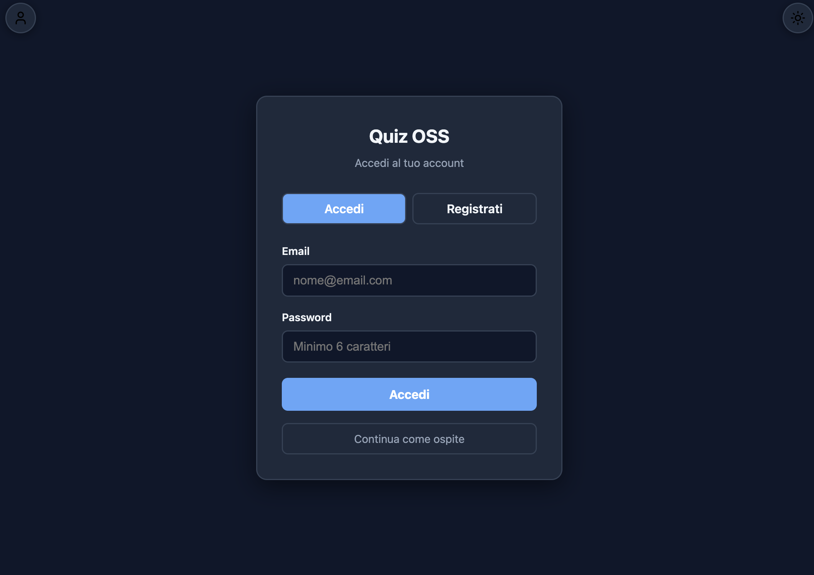
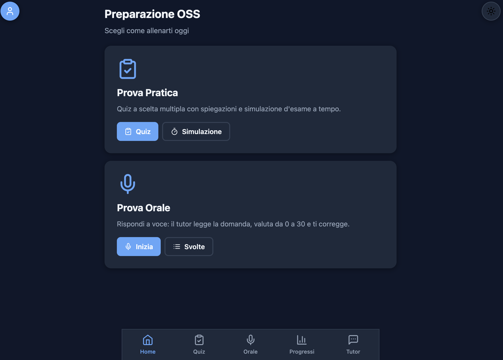
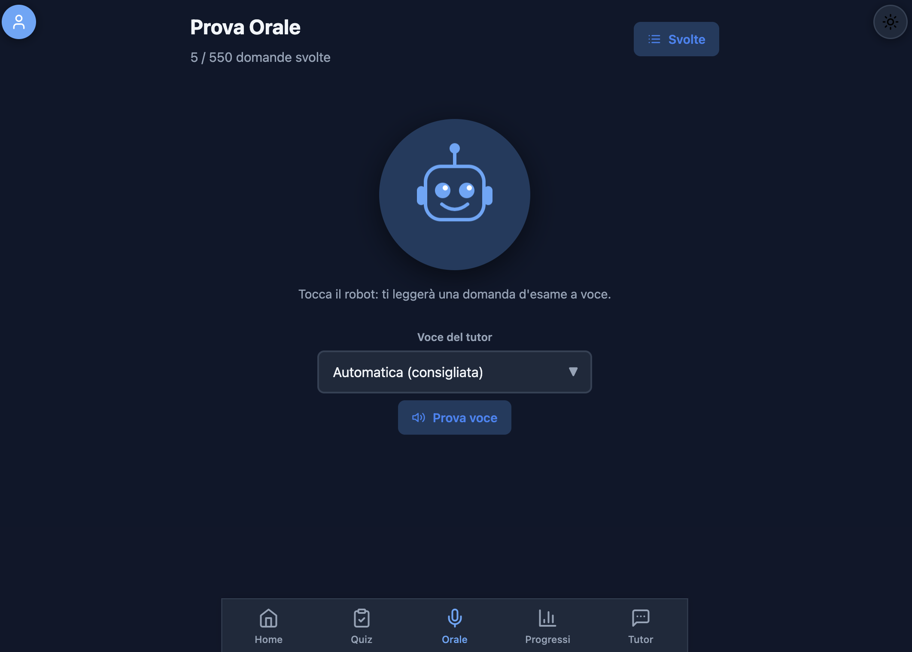
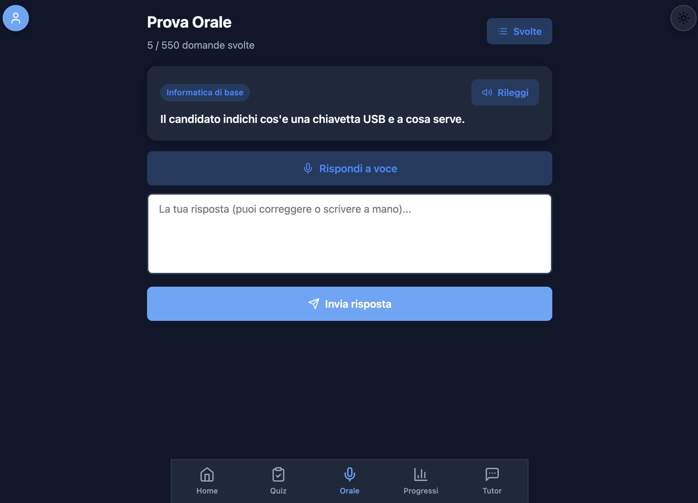
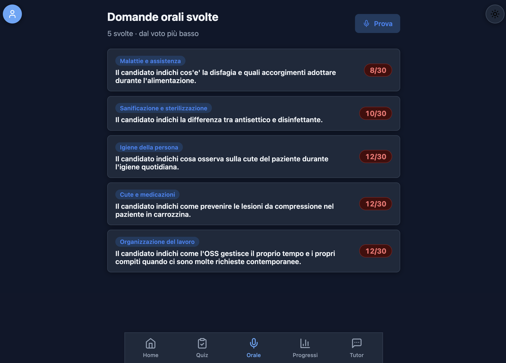
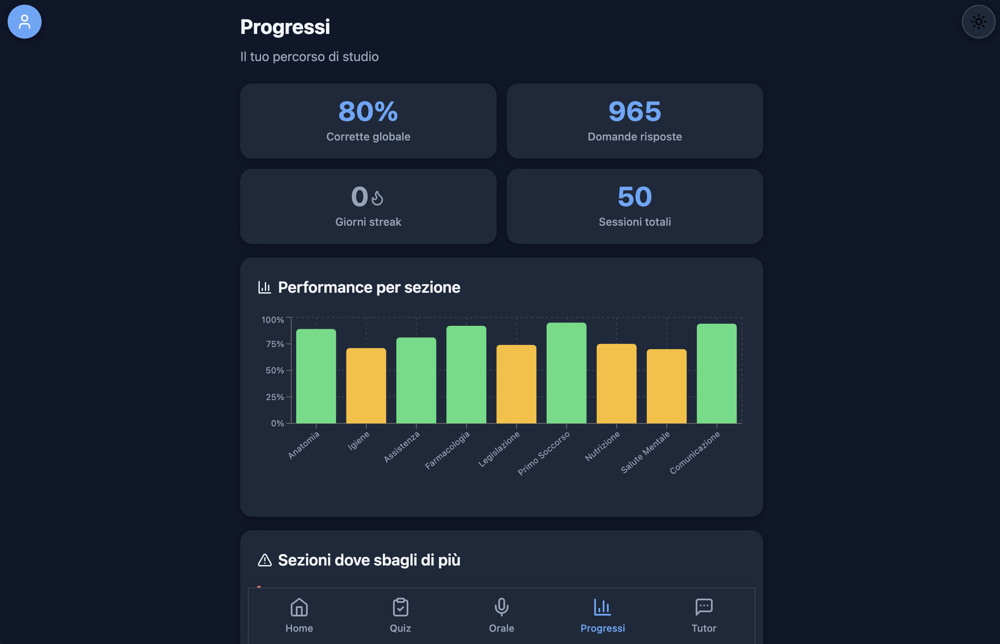
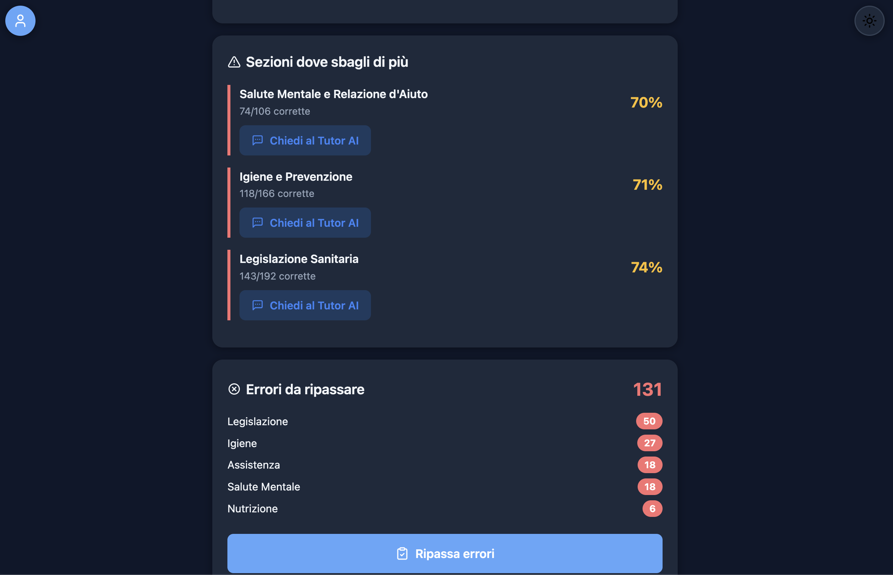
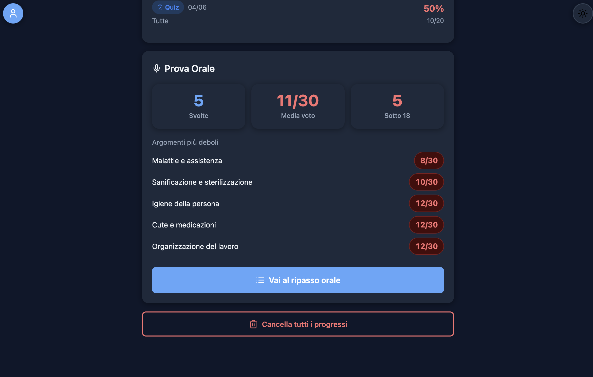
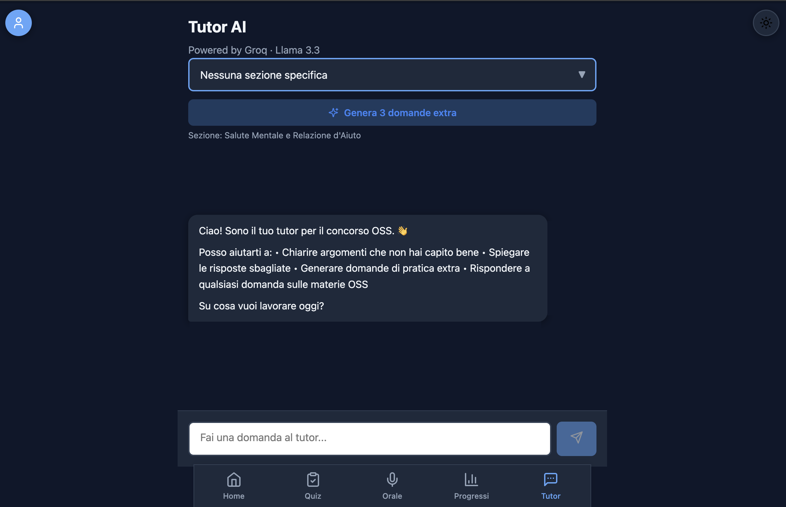

# Quiz OSS

A web application for preparing for the Italian public competition for **Operatore Socio-Sanitario (OSS)** — a healthcare support worker.
I built Quiz OSS as a complete study tool: it covers both the **written exam** (multiple-choice quizzes and a timed exam simulation) and the **oral exam** (spoken answers with automatic grading), together with an AI tutor and long-term progress tracking.

The app is a **Progressive Web App (PWA)**: it installs on a phone or desktop like a native application, works offline for the study part, and updates itself automatically.

## Objective

To provide a realistic and measurable preparation path for the OSS competition, bringing into a single tool the practice of questions, the simulation of real exam conditions, targeted review of the weakest topics, and training for the oral examination.

## Screenshots

| | |
| :---: | :---: |
| **Login** | **Home — choose a mode** |
|  |  |
| **Oral exam — start and voice picker** | **Oral exam — answering** |
|  |  |
| **Completed oral questions** | **Progress — overview** |
|  |  |
| **Progress — review and errors** | **Progress — oral section** |
|  |  |
| **AI Tutor** | |
|  | |

## Features

### Practice mode

- **Multiple-choice quiz**: a bank of 708 questions split into 9 sections (Anatomy and Physiology, Hygiene and Prevention, Personal Care, Basic Pharmacology, Health Legislation, First Aid, Nutrition, Mental Health, Communication). Filtering by section, configurable length (10/20/30/all), and immediate feedback with an explanation.
- **Error review**: wrong answers are stored and ordered by an "urgency" score that considers the number of mistakes, how recent they are, and the response time, prioritising the most critical topics.
- **Exam simulation**: 15 random questions, a 25-minute limit, no feedback during the test, a 60% pass threshold, and a full answer breakdown at the end.

### AI Tutor

A conversational assistant based on a large language model (Llama 3.3 70B via Groq) that explains wrong answers, generates extra practice questions for a specific section, and answers free-form questions about the exam subjects. User input is sanitised against prompt-injection attempts, with server-side rate limiting and client-side throttling.

### Oral exam mode

A training mode for the oral examination, based on the browser's Web Speech APIs:

- the user chooses what to practise on: the general part (excluding IT), IT only, or everything;
- the app draws a random question that has not been answered yet from a bank of 1,030 questions across 31 topics and reads it aloud (Italian speech synthesis, with a voice picker);
- the user answers by voice; the answer is transcribed automatically, with the option to correct it or type it manually as a fallback;
- the answer is graded by a language model against a 0-to-30 rubric anchored to the expected key points, with a correction, a link to a related care topic, and a short spoken summary;
- answered questions move to a dedicated section, sorted from the lowest grade, where they can be reviewed and repeated (the grade updates to the latest attempt).

### Progress and statistics

Percentage of correct answers per section (bar chart), a count of consecutive study days, a list of errors to review and of the weakest sections, session history, and progress export/import.

### Account and synchronisation

Email-and-password sign-up and sign-in, with automatic data synchronisation across devices (sessions, errors, streak, oral answers), real-time updates, and offline operation. The detailed behaviour is described below.

## Tech stack

- **Frontend**: React 18, Vite 6, React Router, Recharts for charts, react-markdown for rendering the tutor's responses.
- **PWA**: vite-plugin-pwa with a service worker and automatic updates.
- **Serverless backend**: a Vercel Edge function (`api/groq.js`) acting as a proxy to the Groq API.
- **Database and authentication**: Supabase (PostgreSQL, Auth, Realtime).
- **Rate limiting**: Upstash Redis.
- **Testing**: Vitest.

## Data synchronisation

The architecture is **offline-first**: every operation is first saved to `localStorage` and then synchronised to Supabase asynchronously. If the network is unavailable the data is still kept locally, and synchronisation resumes by itself once the connection is back.

- **On login**, local data is first pushed to the server and then immediately pulled back and merged with the remote data, so no progress is lost regardless of the device used.
- **Merge strategy**:
  - sessions are deduplicated by identifier (remote wins) and kept up to the last 50;
  - for errors, each question is merged keeping the highest count, the most recent date, the recovered state, and the response times of the most complete record;
  - for oral answers, the latest attempt wins (most recent date);
  - the streak takes the higher of the local and remote values;
  - if errors are missing from the remote profile, they are reconstructed from the session history.
- **Reliability**: every write is retried up to 3 times with exponential backoff; an indicator shows the sync state (in progress, or error).
- **Real time**: the app subscribes to Supabase Realtime channels for changes to its own rows (`profiles` and `quiz_sessions`) and to a broadcast event, realigning the data on receipt. It also polls every 30 seconds while the tab is active and resynchronises when the tab returns to the foreground.
- **Propagated reset**: clearing progress is recognised on other devices too, through a double signal (remote sessions empty, or the errors field explicitly emptied) and a direct broadcast, so propagation works even when database delete events are not delivered. During a reset, pending writes are aborted so they cannot rewrite stale data.

## Security

- The Groq API key lives **on the server only**: the frontend never sees it, and every request goes through the `api/groq.js` function.
- The serverless function **verifies the Supabase JWT signature** with Web Crypto (HMAC SHA-256) and its expiry, applies a sliding-window rate limit (30 requests per IP per hour via Upstash), and validates the payload before forwarding the request to the model.
- **Row Level Security** is enabled on Supabase: each user can read and write only their own data.

## Backend and database (Supabase)

The database uses two tables. The user profile is created on the client at first sign-in, so no database trigger is required.

```sql
-- Tables
create table profiles (
  id uuid references auth.users(id) on delete cascade primary key,
  email text,
  streak_current int default 0,
  streak_last_study_date text,
  wrong_answers jsonb default '{}',
  oral_answers jsonb default '{}',
  created_at timestamptz default now()
);

create table quiz_sessions (
  id bigint primary key,
  user_id uuid references auth.users(id) on delete cascade not null,
  date text not null,
  mode text not null,
  sezione text,
  total int not null,
  correct int not null,
  questions jsonb,
  created_at timestamptz default now()
);

-- Row Level Security
alter table profiles enable row level security;
create policy "own profile" on profiles for all using (auth.uid() = id);

alter table quiz_sessions enable row level security;
create policy "own sessions" on quiz_sessions for all using (auth.uid() = user_id);
```

Profile management was moved entirely to the application layer: I removed the old automatic trigger and added the column for oral answers.

```sql
drop trigger if exists on_auth_user_created on auth.users;
drop function if exists public.handle_new_user();
alter table profiles add column if not exists oral_answers jsonb default '{}';
```

Realtime is also enabled on the `profiles` and `quiz_sessions` tables, which powers the instant synchronisation between devices.

## Technical notes and implementation choices

- **AI proxy on the Edge runtime**: besides token verification and rate limiting, the function caps the output tokens and checks the payload shape. In local development a Vite proxy forwards the same calls, so the key is never exposed even while developing.
- **Smart review**: the urgency score combines the number of errors, how recent they are (with decay over time), the average response time, and a penalty for already-recovered questions, so review starts from the genuinely most critical questions.
- **Streak handling**: it increases if the user studied the previous day, stays unchanged if they already studied today, and resets after a day off.
- **Response times**: recorded per question (last ten, with an average) and used for both the statistics and the urgency score.
- **Data loading**: the JSON question banks are loaded once and cached at the module level, with deduplication of in-flight requests.
- **PWA and caching**: all static assets are precached, while calls to the AI API are configured as network-only so they are never cached; the app updates automatically when a new version is published.
- **UI resilience**: an Error Boundary catches runtime errors and shows a recovery screen; the light/dark theme is persisted locally.
- **Build optimisation**: the bundle is split into separate chunks (core libraries and the charting library) to make better use of the browser cache.

## Configuration and running

### Environment variables

Create a `.env.local` file (see `.env.example`):

```
VITE_SUPABASE_URL=...
VITE_SUPABASE_ANON_KEY=...
GROQ_API_KEY=...
```

For the serverless function in production, configure these in the Vercel project settings:

```
GROQ_API_KEY=...
SUPABASE_JWT_SECRET=...
UPSTASH_REDIS_REST_URL=...
UPSTASH_REDIS_REST_TOKEN=...
```

### Commands

```bash
npm install        # install dependencies
npm run dev        # start the development environment
npm run build      # production build
npm run preview    # preview the build
npm test           # run the tests
```

## Project structure

```
api/groq.js              Serverless proxy to Groq (JWT verification + rate limiting)
public/data/             Question banks: domande.json (written), banca_orale.json (oral)
src/components/          UI components (Quiz, Simulation, Tutor, Oral exam, Progress, ...)
src/context/             Authentication, user state and Realtime handling
src/lib/                 Supabase client
src/utils/               Logic: storage and synchronisation, Groq calls, speech, data
src/styles/              Stylesheets
supabase/migrations/     Database migrations
```

## Deployment

The application is deployed on Vercel. The build is generated automatically on every update and distributed as a PWA.

## Testing

The test suite (Vitest) covers the main application logic: streak calculation, per-section statistics, the urgency score for review, parsing of the model's responses, and oral grading.
